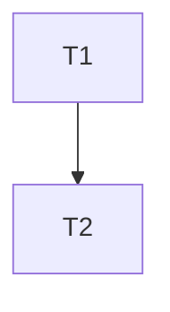

# MOSIP Authentication

## Front end authentication

### Last mile scenarios

| Scenarios | Connectivity | Phone type | Phone ownership | ID type   |
| --------- | ------------ | ---------- | --------------- | --------- |
| R1        | 3G+          | Feature    | Personal        | USSD, SMS |
| R2        | 3G+          | Smart      | Personal        | Inji App  |
| R3        | 3G+          | Smart      | Family          | Inji App  |
| R4        | 3G+          | No phone   | -               | Card      |
| R5        | 2G           | Basic      | Personal        | USSD, SMS |
| R6        | 2G           | Feature    | Personal        | USSD, SMS |
| R7        | 2G           | Feature    | Family          | ?         |
| R8        | 2G           | No phone   | Card            |           |

### USSD Auth

* Enumerator authenticates beneficiary&#x20;
  * Beneficiary types in a USSD message. Receives a token.&#x20;
  * Enumerator reads the displayed token. Possible methods:&#x20;
    * Using OCR.&#x20;
    * Beneficiary sends the token by SMS to Enumerator (?)&#x20;
  * Enumerator enters token in Brollie App.&#x20;
  * The form gets filled automatically with necessary KYC information after verification from the server. (Can the the token be in signed verifiable credential format containing data such that connection to server is not required to fill the form? This may not be possible as USSD messages are limited in characters)&#x20;
  * _How does the beneficiary verify that the enumerator is authentic?_

## Backend authentication
